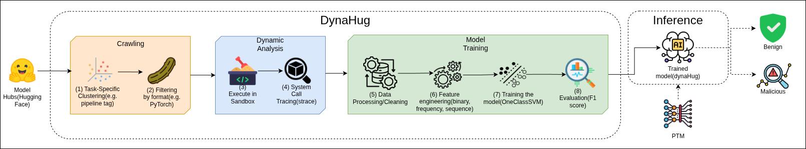

# DynaHug-Detector

- [Paper](./assets/DynaHug-paper.pdf)
- [Website](https://dynahug-detector.github.io/) 

# DynaHug: Learning to Detect Malicious Pre-trained Models via Dynamic Analysis

This is the official repository for DynaHug: **Dyna**mic Analysis of **Hug**gingFace Models for Security against Pre-Trained Model Supply Chain Attacks.

## Workflow Diagram


## Datasets 
We use a total of 18,163 models for the paper. We train DynaHug on the top 2,000 models, sorted by likes from HuggingFace. We also employ datasets from Malhug (84) and PickleBall (4) as part of our malicious set, totalling 88 real malicious models.
Further, we injected 2,000 models with malicious payloads to train and evaluate our model. The rest of the models were part of the ablation study (RQ3) and Clustering test (RQ4).

## Artifact location
The artifacts including the pre-trained classifier models, strace logs, structured CSVs/parquet files for features, evaluation results and other metadata can be found in the [Zenodo](https://zenodo.org/records/17646812) setup.

## Baselines 
We compare DynaHug to the current state-of-the-art (RQ2). We
evaluate existing open-source detectors encompassing both
static and dynamic analysis. We evaluate [PickleScan](https://github.com/mmaitre314/picklescan), [ModelScan](https://github.com/protectai/modelscan) and [Fickling](https://github.com/trailofbits/fickling) as our static analysis tools, and [ModelTracer](https://github.com/s2e-lab/hf-model-analyzer) as our Dynamic analysis tool.
Furthermore, We also evaluate whether
LLMs can serve as an effective malicious PTM detector by
replacing our classifier with an LLM and using the raw traces
collected from dynamic analysis as an input. The LLM of choice was [Llama-3.1-8B-Instruct](https://huggingface.co/meta-llama/Llama-3.1-8B-Instruct).

## High-level Overview of Project Directory

```markdown
DynaHug/
├── assets
├── classifier
├── data
├── Dockerfile
├── experiments
├── LICENSE
├── main.py
├── malicious_detection_logs
├── metadata
├── nc-injected.sh
├── pyproject.toml
├── README.md
├── requirements.txt
├── src
├── utils
└── uv.lock
```

- **assets/** - Any assets that would be useful for understanding the project. Currently, it contains the PDF of the DynaHug paper and the workflow diagram.
- **data/clean_dataset/** - Benign models and datasets.
- **data/malicious_dataset/** - Malicious models from various sources (MALHUG, Pickleball, HF API detected models). Injected models are downloaded from GCS during runtime and their trace are collected due to the lack of space to store them all on local disk.
- **classifier** - Classifier related code and data.
- **classifier/data/** - Structured files for data to be used in classifier training or evaluation. There are folders within this directory named after the dataset and feature combination used for training. Each of these folders contain CSV files of the unseen test set on which the trained models were evaluated on.
- **classifier/models/** - A folder containing all the pre-trained classifier models. The models are divided based on the task tag of PTMs it was trained on. It contains sub-folders with the folder named after the dataset and feature combination used for training. Folders with names ending with `_best` contain the fully trained and tuned model pickle files along with SHAP analysis plots on the unseen test sets (during training).
- **metadata/** - Checksum logs, model evaluation results, training data model names, and other metadata CSVs.
- **metadata/models** - Contains the CSVs which list the model names detected as anomalies during evaluation for each task-tag. 
- **malicious_detection_logs/** - Logs from security detection tools (ProtectAI, AVScan, ClamAV, HF Picklescan, VirusTotal) (scanning still in progress).
- **logs/** - Logs from dynamic analysis runs. Logs folder is organized as follows:
```markdown
logs
├── clean-straces
│    └── model
│        └── text-generation
│            └── training_set
│                ├── strace_logs_Ritori__Yura_GPT--Ritori__Yura_GPT__pytorch_model.bin_count.log
│                └── strace_logs_Ritori__Yura_GPT--Ritori__Yura_GPT__pytorch_model.bin_logs.log
└── malicious-straces
    └── model
        └── text-generation
            ├── strace_logs_star23__sm-1--pytorch_model.bin_count.log
            └── strace_logs_star23__sm-1--pytorch_model.bin_logs.log
``` 
All PyTorch model deserialization strace logs are stored in the models directory. The logs are divided into clean and malicious straces. Within the clean-straces directory, logs are organized by task tag, with each task-tag subdirectory containing additional subfolders named according to the function associated with the corresponding strace logs. Each of these function-specific folders contains the strace log files, which follow the naming convention: `strace_logs_<repo_name>--<file_path>_<count|logs>.log` where the file_path represented the PyTorch file to be deserialized separated by `__` to represent a `/` (e.g., `Ritori__Yura_GPT__pytorch_model.bin` is the same as `Ritori__Yura_GPT/pytorch_model.bin`). Files ending with `_count.log` contain summarized syscall counts, while those ending with `_logs.log` contain the complete strace output.

The malicious-straces directory follows a similar structure except that the task-tags also indicate the function for which the strace logs were collected (e.g., MALHUG_injected_text-classification).
- **output/** - Standard output during the the dynamic analysis runs. 
- **src/** - Source code folder containing all the core logic for downloading, dynamic analysis, archival and strace parsing.

## Notations
- <> - Any value inside the angle brackets are placeholders for the user to replace with actual values.

## Requirements

### Docker setup
Docker ensures a consistent and reproducible environment to run the dynamic analysis pipeline. Install Docker from [here](https://docs.docker.com/engine/install/).

### Python Environment Setup
This setup instructions are for installing Python dependencies and running most of the code on your local system. These setup steps can be skipped if you are using the Dockerfile provided with this repository. 

Firstly, setup the uv package manager by following the instructions [here](https://docs.astral.sh/uv/getting-started/installation/).

All dependencies are listed in `requirements.txt` or the `uv.lock` file. Install them using one of the following commands:
```bash
uv add -r requirements.txt
```
or 
```bash
uv sync
```

### Google Cloud Setup
If you plan to test out the entire pipeline including uploading results to Google Cloud Storage (GCS), you need to set up a GCP account and create a GCS bucket. Follow the instructions [here](https://cloud.google.com/storage/docs/creating-buckets) to create a bucket. Also, ensure that you have the necessary permissions and authentication set up to allow the code to upload files to your GCS bucket as detailed [here](https://cloud.google.com/sdk/gcloud/reference/init).

Key dependencies include:
- **torch** - PyTorch for loading model weights
- **scikit-learn** - Machine learning tools and models (Isolation Forest, One-Class SVM, and SGD One-Class SVM)
- **pandas** - Data manipulation and analysis
- **google-cloud-storage** - For uploading analysis results to GCS
- **huggingface_hub** - For downloading models from Hugging Face
- **psutil** - System monitoring and memory tracking
- **zstandard** - For creating and extracting archives
- **numpy** - Numerical computations
- **shap** - SHAP values for feature importance analysis
- **matplotlib** and **seaborn** - Plotting and visualization

## Command-line Arguments for main.py

### Essential Arguments

- `--bucket-name <bucket>`
  GCS bucket name for uploading results.

- `--work-dir <dir>` (default: ./)
  Working directory for the code.

- `--tag <tag>` *(required)*
  Specify the model task-tag/category to process (e.g., 'text-generation', 'text-classification').

- `--file-type {benign|malicious|both}` (default: benign)
  Type of files to analyze: benign models, malicious models, or both.

- `--isModel` (default: False)
  Analyze models. If not set, analyzes datasets instead. However, datasets are currently not supported in the code.

### Pipeline Control

- `--run-inference` (default: False)
  Execute a pipeline of operations based on the choices of active components.

- `--active-components <components>` (default: all)
  Specify which pipeline components to run (space-separated):
  `download dynamic-analysis classifier remove-explored gcsupload cleanup`
  1. **download** - Download models from Hugging Face Hub
  2. **dynamic-analysis** - Run strace analysis on model deserialization
  3. **classifier** - Detect anomalies using trained ML models
  4. **remove-explored** - Clean up already analyzed models
  5. **gcsupload** - Upload results to Google Cloud Storage
  6. **cleanup** - Clean up local files after processing
- `--num-models <int>` (default: 10000)
  Number of models to download and analyze.

- `--space-limit-gb <float>` (default: 100)
  Maximum disk space to use for downloads in GB.

- `--best-model-path <path>` (default: None)
  Path to the pre-trained classifier model for anomaly detection.
  
### Download & Mode Options

- `--mode {pytorch|pytorch_model.bin|generalized}` (default: generalized)
  Filter mode for model files:
  - `pytorch` - Extract files HuggingFace would extract with from_pretrained().

  - `pytorch_model.bin` - Only pytorch_model.bin files
  
  - `generalized` - All valid pickle files with supported extensions

- `--download_from_csv` (default: False)
  Download models from a previous model list CSV instead of querying HF API. The CSV should contain a column named 'name' with the model identifier on HuggingFace. (e.g., 'deepseek-ai/DeepSeek-R1')

### Modes for experiments

- `--wild-run` (default: False)
  Run classifier on wild models from HuggingFace (requires pre-trained model).

- `--retrieve-mal-models` (default: False)
  Retrieve malicious models using HuggingFace security detection tools.

- `--injected-models` (default: False)
  Process injected models with MALHUG or PyPI payloads from GCS.

- `--checksum-verify` (default: False)
  Verify checksums of models in GCP bucket against HuggingFace originals.

### Feature & Output Options

- `--feature-types <types>` (default: presence frequency)
  Feature types to extract from syscall data (space-separated):
  `presence` `frequency` `sequence`

- `--save-count-per-sample` (default: False)
  Save syscall counts per sample to CSV files.

## Instructions to run 

### Basic Setup 

First, clone the repository: 
```bash
git clone https://github.com/DynaHug-Detector/DynaHug.git
```

Then cd into the project directory:
```bash 
cd DynaHug
```

Note: All the below commands assume you are in the project root directory.

If you prefer to run the code outside of the Docker container, skip this section. For setting up the Docker image and the container, follow these steps:
1. Build the Docker image: 
```bash
docker build -t <image_name> .
```
2. Run the Docker container:
```bash
docker run -it -d --name dynahug_container <image_name> /bin/bash 
```
Now, a docker container named `dynahug_container` is running in the background. You can access it with the Terminal section of the Docker container in the GUI or execute the following command in the CLI:
```bash
docker exec -it dynahug_container /bin/bash
```
or attach to it using the [VSCode Dev Container extension](https://marketplace.visualstudio.com/items?itemName=ms-vscode-remote.remote-containers). 

The main pipeline is orchestrated through `main.py` with different modes and components.

**Basic command structure:**
```bash
uv run main.py --tag <tag> [options]
```
Here, the `<tag>` refers to the model task/category you want to analyze (e.g., 'text-generation', 'text-classification') in Hugging Face. We have compiled an exhaustive list of tags present in Hugging Face [here](link-to-static-repo).

Although, these operations can take quite a while to execute due to which creating a detached session with `tmux` or `nohup` is recommended:
For `tmux`:
```bash
tmux new -s dynahug_session
```
and then run the full formed command inside this session.

or 
```bash
nohup uv run main.py --tag <tag> [options] &
```

### Running Crawling + Dynamic Analysis + Archival Pipeline

**For benign models (Training or Evaluation Test set Collection):**
```bash
uv run main.py --tag <tag> --file-type benign --isModel --run-inference --num-models <number-of-models> --bucket-name <gcs-bucket-name> --active-components <active-components> --mode <mode>
```

Example:
```bash
uv run main.py --tag all --num-models 2000 --space-limit-gb 30 --bucket-name temp-bucket --file-type benign --isModel --run-inference --active-components dynamic-analysis download gcsupload cleanup --mode pytorch_model.bin
```

**For malicious models (MALHUG or PickleBall dataset):**
```bash
uv run main.py --tag <tag> --file-type malicious --isModel --run-inference
```
Make sure to have a local copy of the malicious models before running the above command. Place these malicious models under `data/malicious_dataset/model/MALHUGxPickleball/`.

Example:
```bash
uv run main.py --tag text-generation --file-type malicious --isModel --run-inference
```

**For models with MALHUG or PyPI injected payloads:**
```bash
uv run main.py --tag text-generation --injected-models --isModel --bucket-name <gcs-bucket> --active-components <active-components>
```

Example:
```bash
uv run main.py --tag text-generation --injected-models --isModel --bucket-name temp-bucket --active-components download dynamic-analysis cleanup
```

### Training the Classifier
To train the classifier, convert the syscalls logs collected during crawling and dynamic analysis into fundamental presence, frequency and sequence features by running:
```bash
uv run strace_analyzer.py --tag <tag> --benign-dir <benign-strace-logs-dir> --malicious-dir <malicious-strace-logs-dir> --ext <csv|parquet>
```

Example:
```bash
uv run strace_analyzer.py --tag text-generation --benign-dir classifier/data/clean-straces/text-generation --malicious-dir classifier/data/malicious-straces/text-generation --ext parquet
```

Refer to `strace_analyzer.py` for more details on the arguments.

Once, the features are stored in CSV or Parquet format inside `classifier/data/<tag>`, you can train the classifier using the following command:
```bash
uv run classifier/svm.py --tune-hyperparam --num-benign-samples <num-benign-samples> --tag <tag> --feature-types <feature-types> --model-type <model-type> --mode <mode>
```

Example:
```bash
uv run classifier/svm.py --evaluate --num-benign-samples 2000 --tag text-generation --feature-types presence frequency sequence_presence sequence_frequency --tune-hyperparam --model-type ocsvm --mode new_model
```
The code and arguments related to training and evaluating the classifier are present inside the `classifier/svm.py`. It supports multiple feature types extracted from syscall traces:
- **presence** - Binary presence of syscalls
- **frequency** - Frequency/count of syscalls
- **sequence** - N-gram sequences of syscalls
- **process sequence** - Process-level syscall sequences

**Model Types:**
- One-Class SVM (ocsvm) (with various kernels: rbf, linear, sigmoid)
- Isolation Forest (isoforest)
- SGD-based One-Class SVM (sgdsvm) (with various kernels: rbf, linear, sigmoid, poly)

Pre-trained models are available in `classifier/models/` directory organized by dataset and feature combinations.

If you want to train a static or hybrid model, you would have to add the `--analysis-type static|hybrid` argument to the above command after making sure you have the necessary CSV/parquet files.

### Evaluating the Trained Classifier

```bash
uv run classifier/svm.py --tag <tag> --evaluate --feature-types <feature-types> --best-models <path-to-best-model> --analysis-type <static|dynamic|hybrid>
```

This will load the pre-trained model from `classifier/models/` and evaluate it on the specified data.

Example:
```bash
uv run classifier/svm.py --tag text-generation --evaluate --feature-type presence frequency --best-models classifier/models/text-generation/2000_benign_data_presence_frequency_new_logs_std_scaler_nomean_best/OneClassSVM/params-gamma_0.1_kernel_rbf_nu_0.01/ --analysis-type dynamic
```

Note: A presence model can be provided a feature set of presence, frequency, and sequence features combined. The Vectorizer will handle the combination and automatically pick the presence features. This applies for all combinations of feature types. Hence, you can provide all the features in the `--feature-types` argument while evaluating the model.

Also, note that the `--best-models` argument should point to the directory containing the pre-trained model, the vectorizer and the scaler pickle file.

Refer to the [Models from the paper](#models-from-the-paper) section below for the paths of pre-trained models used in the DynaHug paper.

## Usage 

### Core Files

- **main.py** - Main pipeline orchestrator. Handles downloading, dynamic analysis, classification, and GCS upload. Supports multiple modes (benign, malicious, injected).

- **analysis.py** - Runs dynamic analysis using `strace`. Executes `inference.py` with strace wrappers to capture system calls during pickle deserialization.

- **inference.py** - Deserializes pickle/PyTorch files and tracks memory usage.

- **strace_analyzer.py** - Analyzes strace output logs. Parses system call counts and generates reports comparing malicious vs benign syscall patterns. Supports n-gram sequence analysis.

- **metadata_collector.py** - Collects and logs timing information, anomalies detected, and malicious models. Manages CSV logging for batch processing.

- **download.py** - Downloads models from Hugging Face Hub with space constraints. Supports multiple filtering modes (pytorch, pytorch_model.bin, generalized) and implements memory safety checks.

- **utils.py** - Utility functions for:
  - GCS file operations (upload/download)
  - Archive creation and extraction
  - Model metadata extraction
  - File system operations
  - HuggingFace API interactions

### Classifier Files

- **classifier/svm.py** - Main classifier implementation (`SyscallAnomalyDetector`). Features:
  - Multiple classifier options (One-Class SVM, Isolation Forest, SGD-based One-Class SVM)
  - Configurable feature extraction (presence, frequency, sequence, proc sequence)
  - Model training, evaluation, and inference
  - Feature importance analysis using SHAP

- **classifier/invariant.py** - Invariant analysis for detecting anomalies

- **classifier/opcodes.txt** - Exhaustive list of opcodes for opcode-based analysis

- **classifier/LLM_eval.ipynb** - Jupyter notebook for evaluating LLM models using the strace logs from dynamic analysis.

- **classifier/syscalls.txt** - Exhaustive list of system calls used as features

## Models from the Paper

The pre-trained classifier models used in the DynaHug paper can be found in the `classifier/models` directory. Specifically, below are the models used in the paper.

text-generation models:
1. DynaHug (default): `classifier/models/text-generation/2000_benign_data_presence_frequency_new_logs_std_scaler_nomean_best/OneClassSVM/params-gamma_0.1_kernel_rbf_nu_0.01`
2. DynaHug (static): `classifier/models/text-generation/2000_benign_data_presence_frequency_new_logs_std_scaler_nomean_static_best/OneClassSVM/params-gamma_0.01_kernel_linear_nu_0.01`
3. DynaHug (hybrid): `classifier/models/text-generation/2000_benign_data_presence_frequency_hybrid_new_logs_std_scaler_nomean_best/OneClassSVM/params-gamma_0.01_kernel_rbf_nu_0.04`
4. DynaHug (presence): `classifier/models/text-generation/2000_benign_data_presence_new_logs_std_scaler_nomean_best/OneClassSVM/params-gamma_1_kernel_rbf_nu_0.01`
5. DynaHug (frequency): `classifier/models/text-generation/2000_benign_data_frequency_new_logs_std_scaler_nomean_best/OneClassSVM/params-gamma_0.1_kernel_rbf_nu_0.01`
6. DynaHug (presence, freq, seq): `classifier/models/text-generation/2000_benign_data_presence_frequency_sequence_presence_sequence_frequency_new_logs_std_scaler_nomean_best/OneClassSVM/params-gamma_auto_kernel_rbf_nu_0.01`
7. DynaHug (presence, freq, seq, proc seq): `classifier/models/text-generation/2000_benign_data_presence_frequency_sequence_presence_sequence_frequency_proc_seq_presence_proc_seq_frequency_new_logs_std_scaler_nomean_best/OneClassSVM/params-gamma_auto_kernel_rbf_nu_0.01`
8. DynaHug (Isolation Forest): `classifier/models/text-generation/2000_benign_data_presence_frequency_new_logs_std_scaler_nomean_best/IsolationForest/params-contamination_0.1_max_samples_1000_n_estimators_50_random_state_42`
9. DynaHug (SGD SVM): `classifier/models/text-generation/2000_benign_data_presence_frequency_new_logs_std_scaler_nomean_best/SGDOneClassSVM/params-batch_size_32_gamma_1_kernel_rbf_nu_0.28`
10. DynaHug (1000): `classifier/models/text-generation/1000_benign_data_presence_frequency_new_logs_std_scaler_nomean_best/OneClassSVM/params-gamma_0.1_kernel_rbf_nu_0.01`
11. DynaHug (3000): `classifier/models/text-generation/3000_benign_data_presence_frequency_new_logs_std_scaler_nomean_best/OneClassSVM/params-gamma_0.1_kernel_rbf_nu_0.01`

text-classification models: 

12. DynaHug (text-classification): `classifier/models/text-classification/2000_benign_data_presence_frequency_new_logs_std_scaler_nomean_best/OneClassSVM/params-gamma_0.1_kernel_rbf_nu_0.01` 

non-clustered models:

13. DynaHug (non-clustered): `classifier/models/all/2000_benign_data_presence_frequency_new_logs_std_scaler_nomean_best/OneClassSVM/params-gamma_0.1_kernel_rbf_nu_0.01`
